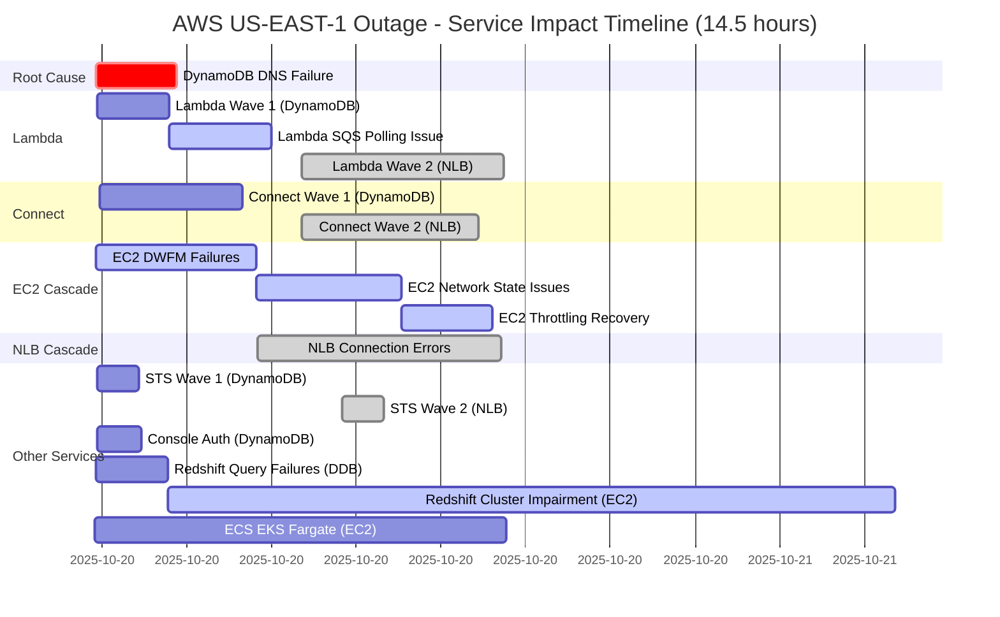

import { ArticleLayout } from '@/components/ArticleLayout'

export const meta = {
  author: 'Daniel Butler',
  date: '2025-10-27',
  title: 'AWS Outage - Network Load Balancer Take',
  description:
    'Flapping in the wild.',
  tags: ['AWS', 'Infrastructure', 'Post-Mortem'],
}

export default (props) => <ArticleLayout meta={meta} {...props} />

 > The opinions and information expressed in this post, and every other one, are my own and in no way reflect the opinion of my employer, Amazon.

A lot has been discussed about AWS’s DynamoDB outage already. If you haven’t read it, yet I suggest spending a few minutes to go through it. The best lessons are from the scars of others!

https://aws.amazon.com/message/101925/

There is already a lot on the DNS delegators and how they failed. What I found interesting from reading between the lines was the Network Load Balancer (NLB) failure. AWS has another type of load balancer, Application load balancers (ALB). The ALBs weren’t impacted, why?

The answer basically comes down to a case of real world flapping. This is the NLB quote from the report.

> During the event the NLB health checking subsystem began to experience increased health check failures. This was caused by the health checking subsystem bringing new EC2 instances into service while the network state for those instances had not yet fully propagated. This meant that in some cases health checks would fail even though the underlying NLB node and backend targets were healthy. This resulted in health checks alternating between failing and healthy. This caused NLB nodes and backend targets to be removed from DNS, only to be returned to service when the next health check succeeded.

The likely cause is Network Load Balancers passive health checks - Application Load Balancers don't have them.  Active health checks are calls to endpoint like `/health` while passive health checks monitor actual connections.

> With passive health checks, the load balancer observes how targets respond to connections. Passive health checks enable the load balancer to detect an unhealthy target before it is reported as unhealthy by the active health checks. You cannot disable, configure, or monitor passive health checks. Passive health checks are not supported for UDP traffic, and target groups with stickiness turned on.
> - [Documentation Link](https://docs.aws.amazon.com/elasticloadbalancing/latest/network/target-group-health-checks.html)

The key point is passive health checks watch the actual traffic. There is no slack for errors.  Some requests worked while others didn't causing the targets to flap (`fail` -> `succeed` -`fail` -> `succeed` -> etc).

It’s one of those hard lessons of why you don’t necessary want instantaneous feedback. Quick feedback is good but overwhelming feedback becomes noise or worse.

I’m an outsider looking in, it seems like the biggest mismatch is the resource server wasn’t protected from its clients. Generally throttling is how that protection is implemented.

### Bonus
Below is a visual representation of the failures and the cascading effect it had. The team I am on was impacted after the NLB failures were resolved.

